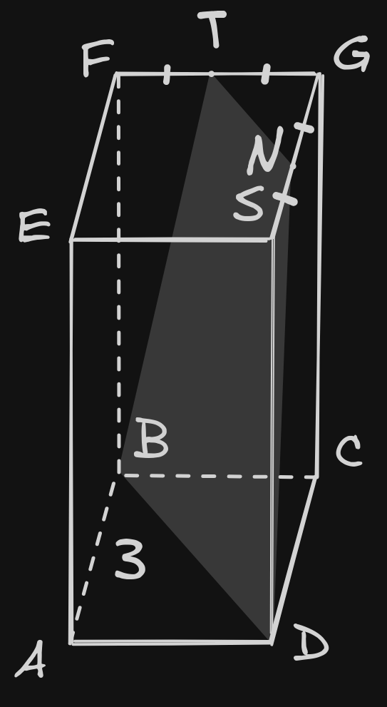
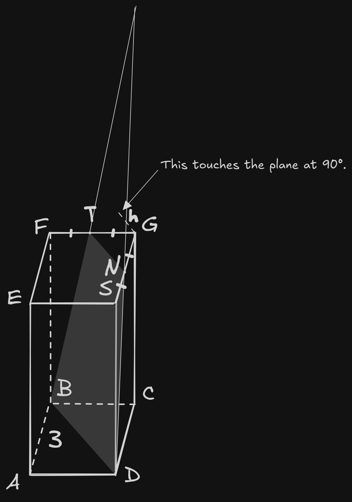

<link href="/style/style.css" rel="stylesheet"/>
<include "header.html">

<blog-header "How geometry blends with calculus", "HEAD of Suggestions", "22-04-2026">

Recently, I came across a mathematical problem from the area of stereometry. I thought it was pretty interesting due to a fairly unexpected way to solve it.
Not to give the game away immediately, the core idea is to integrate calculus.

Alright so, here's the information we're given:

> In the cube *ABCDEFGS*, point *T* is the midpoint of edge *FG*.
> Plane *α* passes through points *B*, *T*, and *D*.
> Find the distance from point *G* to plane *α* if the edge of the cube is *3*.

First of all, let's simply draw what we've been provided with:

For obvious reasons, section *BTND* is an isosceles trapezoid. It's more than trivial to prove this fact, but because that isn't what we're here for,
simply accept this statement as true. As a consequence, $\text{GN} = \text{GT}$. Oh, and the placement of the section is also quite easy to determine; likewise, we aren't going to concentrate on that.

Let's not forget that a plane is infinite and stretch it further up to cover enough space for the height to emerge.

Also, why the heck did I mention the height? Well, what's shorter than a height if we're talking about
the distance between $\text{G}$ and the plane? Nothing.

Let's define a coordinate system where going left increases the $\text{x}$, going up increases the $\text{y}$, and going forward
increases the $\text{z}$. All relative to $\text{D} = (0; 0; 0)$.

$$
\begin{aligned}
\text{T} &= \left( \frac{3}{2}; 3; 3 \right) \\
\text{N} &= \left( 0; 3; \frac{3}{2} \right) \\
\text{B} &= ( 3; 0; 3 )
\end{aligned}
$$

Let's describe the plane with the equation $\text{ax} + \text{by} + \text{cz} = \text{d}$ and tell it about all the points it contains
by simply inserting the coordinates:

$$
\begin{cases}
\begin{aligned}
\text{d} &= 0 \\
\frac{3\text{a}}{2} + 3\text{b} + 3\text{c} &= \text{d} \\
3\text{b} + \frac{3\text{c}}{2} &= \text{d} \\
3\text{a} + 3\text{c} &= \text{d}
\end{aligned}
\end{cases}
$$

Which means:

$$
2\text{ax} + \text{ay} - 2\text{az} = 0
$$

We're going to need the coordinate we're measuring the height from as well:

$$
\text{G} = (0; 3; 3)
$$

With the coordinate of $\text{G}$ now known, let's find the distance between the point and the plane:

$\text{h} = \sqrt{\text{x}^2 + {(\text{y} - 3)}^2 + (\text{z} - 3)^2}$

Alright, let's write out the system of equations:

$$
\begin{cases}
2\text{x} + \text{y} - 2\text{z} = 0 \\
\text{h}^2 = \text{x} + (\text{y} - 3)^2 + (\text{z} - 3)^2
\end{cases}
$$

$\text{a}$ is ignored in the first equation because it cancels out.

Now let's take a look at the system and notice that what we're looking for is the minimum value of $\text{h}$ for $\text{h}$ to actually be the height.
Again, the closest distance *is* the height.

Let's combine the two equations and represent the resulting expression as a function from $\text{x}$ and $\text{z}$.

$$
\text{f}(\text{x, z}) = \text{x}^2 + (2\text{z} - 2\text{x} - 3)^2 + (\text{z} - 3)^2
$$

In order to find the minimum of this function, we're going to leverage partial derivatives.

$$
\begin{cases}
\begin{aligned}
\frac{\text{df}}{\text{dx}} &= 2\text{x} - 4(2\text{z} - 2\text{x} - 3) \\
\frac{\text{df}}{\text{dz}} &= 4(2\text{z} - 2\text{x} - 3) + 2(\text{z} - 3)
\end{aligned}
\end{cases}
$$

In a nutshell, the idea is treating $\text{x}$ as the variable and $\text{z}$ as the constant and the other way around.
When the derivatives of both are 0, it's definitely the minimum and therefore the height,
because no other extrema are present, which you can figure out even geometrically.

Solving the system gives:

$$
\begin{cases}
\text{x} = \frac{2}{3} \\
\text{z} = \frac{7}{3}
\end{cases}
$$

Now let's return to $2\text{x} + \text{y} - 2\text{z} = 0$ and insert the known values to get $\text{y}=\frac{10}{3}$.
Alright, the minimum of $\text{h}^2$ occurs at $\left( \frac{2}{3}; \frac{10}{3}; \frac{7}{3} \right)$.
Because $\text{h}$ is directed determined by $\text{x}$, $\text{y}$ and $\text{z}$, we can get it numerically.

$$
\text{h} = 1
$$

<include "footer.html">
